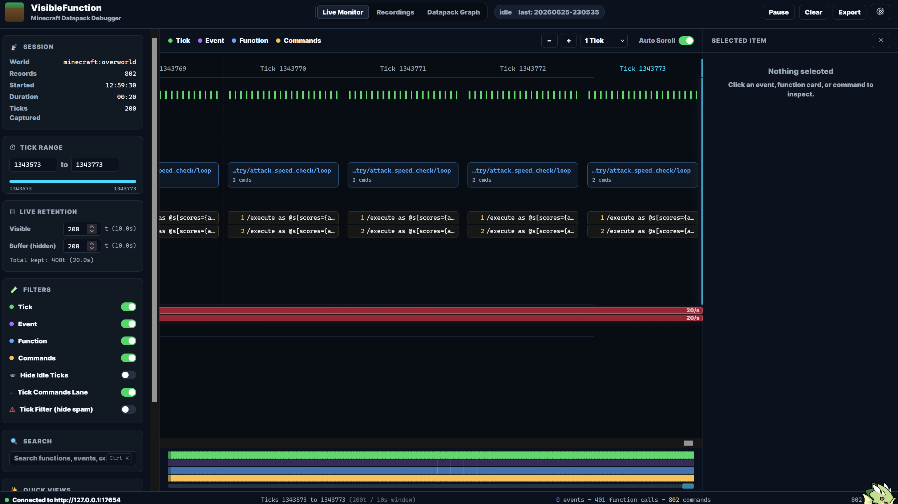
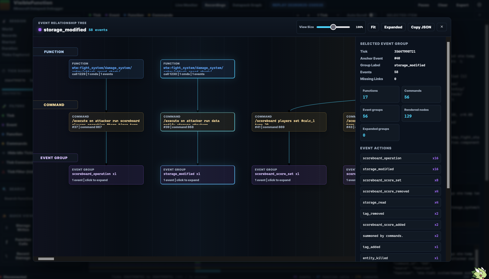
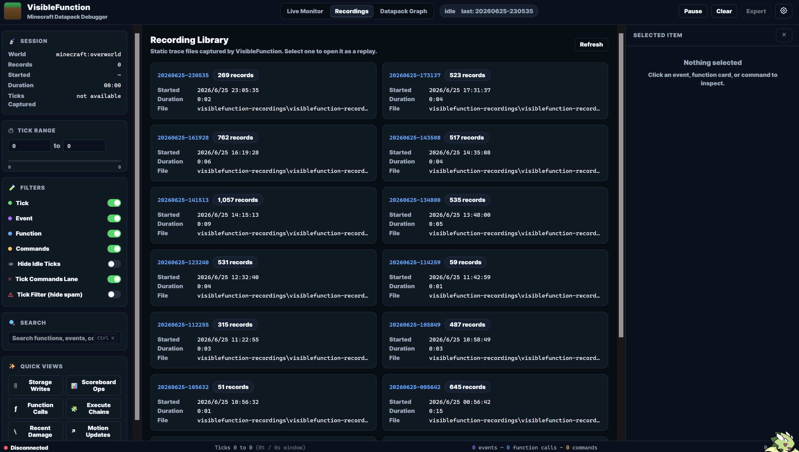
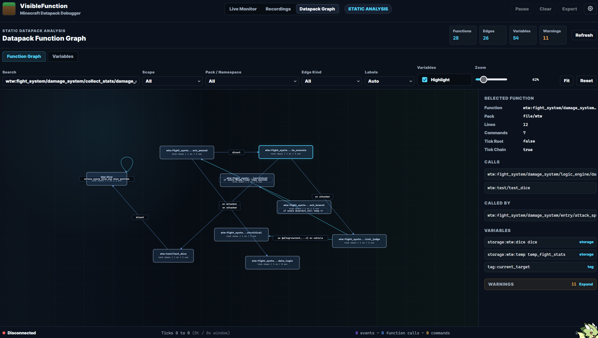

# VisibleFunction

A Fabric debugging mod for Minecraft datapack authors.

VisibleFunction records commands, function calls, and the game events they produce, while preserving the relationships between them. You can inspect recent records in-game, or start the built-in Web frontend to analyze more complex datapacks through timelines, Tick Filter, recording replay, and static function graphs.

> This project is still in early development. The target version is Minecraft 26.2.

## Screenshots

| Live Monitor                                                                               | Live Function Relationship Graph                                                                                          |
| ------------------------------------------------------------------------------------------ | ------------------------------------------------------------------------------------------------------------------------- |
|           |                             |
| Main timeline view for inspecting tick, event, function, and command records in real time. | Function relationship graph generated from live trace records, useful for following runtime command/function/event links. |

| Recording Replay                                                                    | Static Datapack Function Graph                                                            |
| ----------------------------------------------------------------------------------- | ----------------------------------------------------------------------------------------- |
|  |  |
| Recording preview and replay view for inspecting saved trace sessions.              | Static analysis graph for exploring function references and datapack structure.           |

## Features

* **Command Trace**: Records raw commands, sources, function IDs, function call IDs, executors, dimensions, and positions.
* **Event Attribution**: Links commands, functions, and events using `commandId` and `functionCallId`.
* **Event Listeners**: Currently covers summon, give, effect, kill, tp/teleport, scoreboard, tag, and data storage events.
* **Function Tree**: Organizes commands and events by their real function call structure, with separate Recent and Older sections.
* **Tick Filter**: Detects `minecraft:tick` call chains and other high-frequency sources, then aggregates continuous noise away from the main record stream.
* **In-Game Timeline**: Browses command, event, and function records by tick.
* **Web Debugger**: Provides Live Monitor, recording replay, filters, an inspector panel, and Datapack Graph.
* **Static Datapack Analysis**: Analyzes function references, execute conditions, selectors, scoreboard/storage/tag/bossbar variables, entry points, missing targets, and circular calls.
* **Local Recording**: Streams records directly to disk during recording to avoid long-running recordings from continuously occupying game heap memory.

## Requirements

### Runtime

* Minecraft `26.2`
* Fabric Loader `0.19.3` or later
* Fabric API for Minecraft 26.2
* Java `25` or later

For singleplayer, install the mod normally. In multiplayer, the server is responsible for data collection; clients that need the in-game HUD must also install VisibleFunction.

### Build

* JDK 25 or later
* Node.js 18 or later
* npm

Gradle automatically installs dependencies and builds the production frontend from `frontend_v2`, then embeds the frontend assets into the final JAR. Node.js is not required at game runtime.

## Installation

1. Build the project or download a released JAR.
2. Put `visiblefunction-<version>.jar` into the `mods` directory of your Minecraft instance.
3. Install Fabric API as well.
4. Start the game and enter a world.

## Quick Start

Run a datapack command in-game, for example:

```mcfunction
/summon minecraft:zombie
```

Default controls:

| Key   | Action                        |
| ----- | ----------------------------- |
| `\`   | Open the in-game debug window |
| `Esc` | Close the debug window        |
| `]`   | Start or stop recording       |

Start the Web debugger:

```mcfunction
/visiblefunction export start
```

The client will try to open the following URL automatically:

```text
http://127.0.0.1:17654/
```

If the browser does not open automatically, visit the address manually. Stop the server with:

```mcfunction
/visiblefunction export stop
```

The Export Server only listens on the local loopback address. It is not exposed to your LAN or the public Internet by default.

## Game Commands

| Command                                             | Description                                                     |
| --------------------------------------------------- | --------------------------------------------------------------- |
| `/visiblefunction`                                  | Show current status                                             |
| `/visiblefunction status`                           | Show current status                                             |
| `/visiblefunction enabled <true\|false>`            | Enable or disable event collection                              |
| `/visiblefunction output <window\|chat\|log\|both>` | Set the in-game output target                                   |
| `/visiblefunction window width <160..640>`          | Set HUD width                                                   |
| `/visiblefunction window lines <2..24>`             | Set the maximum number of HUD lines                             |
| `/visiblefunction window timeout <1000..60000>`     | Set how long the unfocused HUD remains visible, in milliseconds |
| `/visiblefunction timeline buffer <20..1200>`       | Set the number of ticks retained by the in-game timeline        |
| `/visiblefunction export start`                     | Start the API, SSE stream, and built-in Web frontend            |
| `/visiblefunction export stop`                      | Stop the Export Server                                          |
| `/visiblefunction export status`                    | Show frontend and API addresses                                 |
| `/visiblefunction export port <1024..65535>`        | Change the Export Server port                                   |
| `/visiblefunction recording toggle`                 | Toggle recording                                                |
| `/visiblefunction recording start`                  | Start recording                                                 |
| `/visiblefunction recording stop`                   | Stop and save the recording                                     |
| `/visiblefunction recording status`                 | Show recording status                                           |

Current configuration is stored inside the running game instance and resets to default values after restart.

## Web API

After starting the Export Server, the following read-only endpoints are available:

| Endpoint                        | Content                                             |
| ------------------------------- | --------------------------------------------------- |
| `GET /`                         | Built-in Web frontend                               |
| `GET /health`                   | Service status, session ID, and cached record count |
| `GET /api/v1/records`           | Flat `TraceRecord` list                             |
| `GET /api/v1/grouped`           | Records grouped by category and function            |
| `GET /api/v1/tick-filter`       | Tick Filter aggregation results                     |
| `GET /api/v1/datapack-analysis` | Static datapack analysis snapshot                   |
| `GET /api/v1/stream`            | Real-time SSE record stream                         |
| `GET /api/v1/recording/status`  | Current recording status                            |
| `GET /api/v1/recordings`        | Local recording list                                |
| `GET /api/v1/recordings/latest` | Latest recording                                    |
| `GET /api/v1/recordings/<id>`   | Specific recording content                          |

Record endpoints support the `after`, `limit`, and `tail` query parameters. For more complete field descriptions and frontend integration notes, see:

* [Datapack Analysis API](docs/datapack-analysis-api.md)
* [Frontend Integration Guide](docs/frontend-agent-brief.md)

## Recording Files

After pressing `]` or running a recording command, VisibleFunction streams records into:

```text
visiblefunction-recordings/
```

When recording stops, it generates `visiblefunction-recording-<id>.json`. Recording files are not automatically committed to Git.

Recordings may contain:

* Raw commands and function paths
* Entity, item, scoreboard, and storage information
* NBT summaries
* Player names, UUIDs, execution positions, and dimensions

Please inspect recording files before sharing them publicly to make sure they do not contain data you do not want to disclose.

## Building from Source

Windows:

```powershell
.\gradlew.bat clean build
```

Linux or macOS:

```bash
./gradlew clean build
```

Build outputs are located at:

```text
build/libs/visiblefunction-<version>.jar
```

When working only on the Web frontend:

```bash
cd frontend_v2
npm ci
npm run dev
```

The Vite development server proxies `/health` and `/api` to `http://127.0.0.1:17654` by default. Run `/visiblefunction export start` in-game first to connect to real data.

## Project Structure

```text
src/main/       Server-side collection, command attribution, recording, Export API, and static analysis
src/client/     In-game HUD, Function Tree, Tick Filter, and timeline
frontend_v2/    Current Web debugger
docs/           API and frontend integration documentation
```

## Known Limitations

* Only common datapack command events are currently covered. Not all game events are listened to.
* Static datapack analysis uses a lightweight command parser designed for debugging. It is not a complete Brigadier AST.
* The Export Server has no authentication because it only binds to `127.0.0.1`.
* Very long recordings will continue to use disk space. Users need to clean up recording files manually after use.

## License

VisibleFunction is licensed under the [MIT License](LICENSE).


